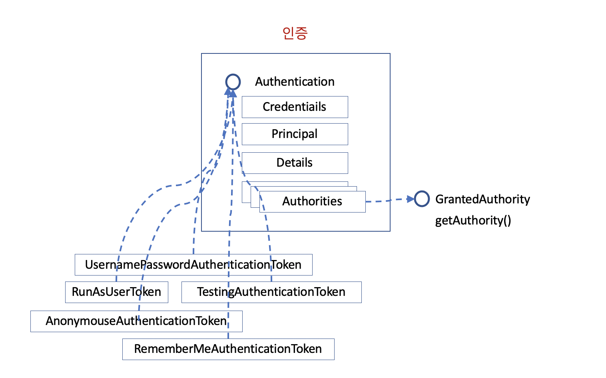
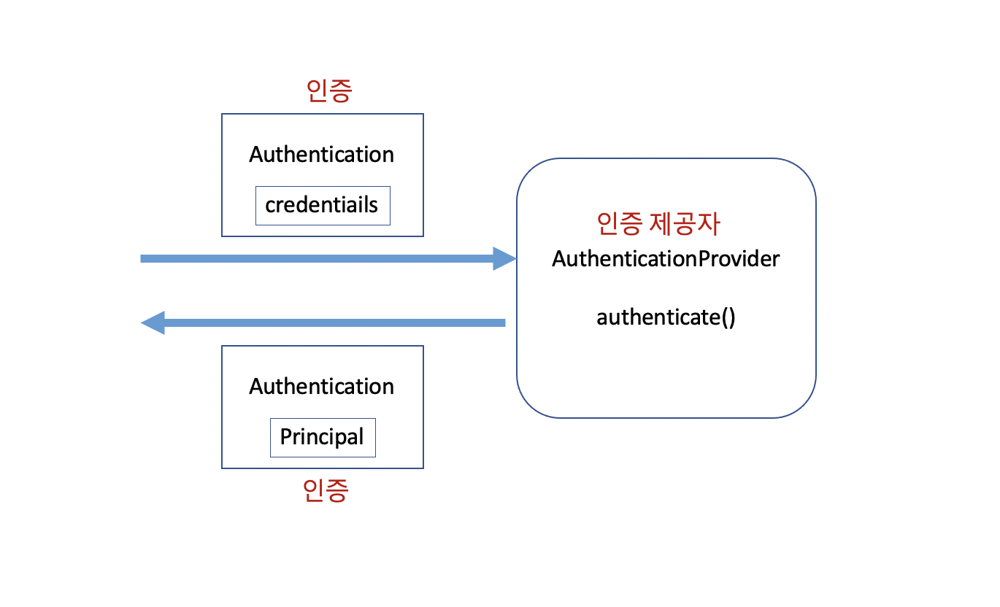
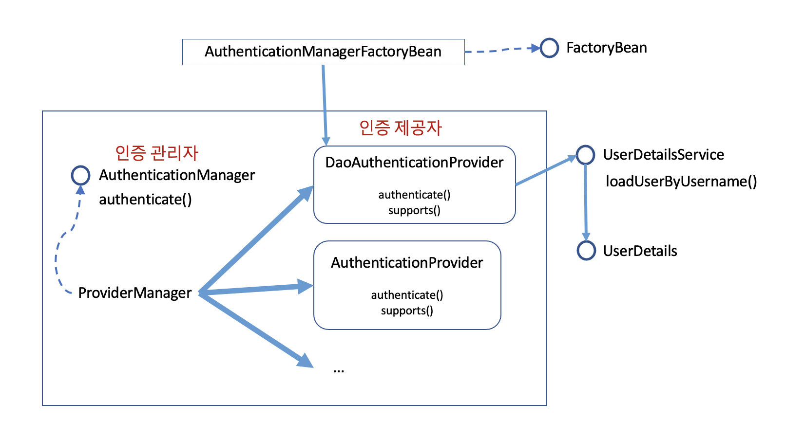

## **Authentication**

인증(Authentication)은 인증된 결과만 저장하는것이 아니고, **인증하기 위한 정보**와 **인증받기 위한 정보**가 동시에 들어있다.  
왜냐하면 인증을 제공해줄 제공자(Authentication Provider)가 어떤 인증에 대해서 허가를 내줄 것인지 판단하기 위해서는, 직접 입력된 인증을 보고, 허가된 인증을 내주는 방식이기 때문이다.

그래서 AuthenticationProvider은 처리가능한 Auth에 대해 알려주는 support 메소드를 지원하고,  
authenticate() 에서 Auth를 입력값과 동시에 출력값으로도 사용한다.

*[Auth]: Authentication

- Credentials : 인증을 받기 위해 필요한 input 정보. 비번 등 (input)
- Principal : 인증해줘야 할 인증 대상 객체 (output)
- Details : 기타 정보, 인증에 관여된 주변 정보들
- Authorities : 권한 정보들

Auth를 구현한 객체들은 일반적으로 Token이라는 객체로 구현된다. 그래서 Auth의 구현체를 인증 토큰이라고 부른다.

Auth 객체는 SecurityContextHolder를 통하여 세션이 있건 없건 언제든 접근할 수 있도록 필터체인에서 보장해준다.

---

## **AuthenticationProvider**

인증 제공자(AuthenticationProvider)는 기본적으로 Auth를 받아서 인증하고, 인증된 결과를 다시 Auth 객체로 전달한다.

그런데 인증 제공자는 어떤 인증에 대해서 도장을 찍어줄지 AuthenticationManager에게 알려줘야하기때문에 support() 라는 메소드를 제공한다. 인증 대상과 방식이 다양할 수 있기 때문에 인증 제공자도 여러가지 올 수 있다.

---

## **AuthenticationManager**

- AuthenticationProvider들을 관리하는 interface가 인증 관리자(AuthenticationManager)이고, 이 인증 관리자를 구현한 객체가 ProvideManager 이다.
- ProviderManager도 여러개 존재할 수 있다.
- 개발자가 직접 인증 관리자를 정의해서 제공하지 않으면, 인증 관리자를 만드는 AuthenticationManagerFactoryBean에서 DaoAuthenticationProvider를 기본 인증제공자로 등록한 인증 관리자를 만든다.
- DaoAuthenticationProvider는 반드시 1개의 UserDetailsService를 발견할 수 있어야 한다.  
만약 없으면 InmemoryUserDetailsManager에 `[username=user, password=(서버가 생성한 패스워드)]`인 사용자가 등록되어 제공된다.
